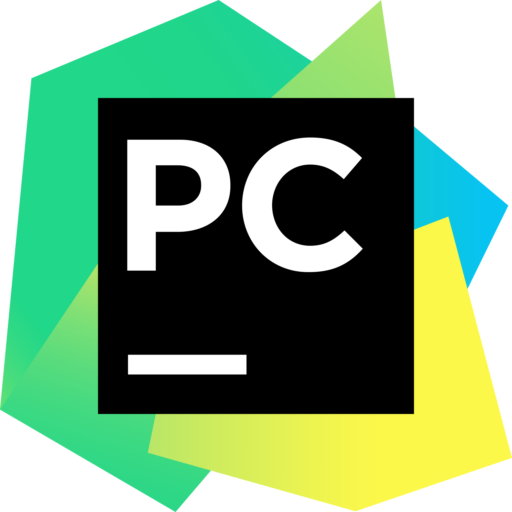

<!--- Olá, esse é meu readme, fique à vontade para utilizá-lo como quiser! -->

-----

<div>

</div>

-----

<div align="justify">
<i><b>Olá</b> :wave:, sou a <code>Maisa</code>, tenho 19 anos, moro em Pedro Leopoldo e sou programador desde os 16 anos de idade. Atualmente sou <code>estudante</code> no curso de Sistemas de Informação do <a href="https://newtonpaiva.br/" target="_blank">Centro Universitário Newton Paiva</a></i> :man_teacher:.<br />
</div>

-----

Sobre mim:

<div align="justify">
Técnico em <a href="https://polimig.com.br/tecnico-informatica/" target="_blank">Informática</a> pela <a href="https://polimig.com.br/" target="_blank">Escola Politécnica de Minas Gerais</a> (2020-2022). 
Cursa graduação em <a href="https://newtonpaiva.br/cursos/graduacao/sistemas-de-informacao/" target="_blank">Sistemas de Informação</a> pelo <a href="https://newtonpaiva.br/" target="_blank">Centro Universitário Newton Paiva</a> (2023-2026). 
Profissional com 2 anos e meio de experiência no mercado de desenvolvimento de sistemas e há 4 anos estudante na área de tecnologia. 
Atualmente, é Desenvolvedor full-stack Júnior na <a href="https://escalarcomunicacao.com.br/" target="_blank">Escalar Comunicação</a>, 
usando as Linguagens PHP, JS, HTML, CSS junto com as frameworks e bibliotecas como Laravel, Bootstrap, Materialize, Tailwind, React, Angular e jQuery.
Para desenvolvimento de sistemas ERP, CRM, PDV e Gerenciador Alphasignage com soluções para suprir as necessidades dos clientes para o crescimento da sua empresa.
Possui vivência nos campos de: Desenvolvimento de software, Documentação ágil, Implantação de sistemas em âmbito global, Manutenção de sistemas legados, Design patterns e Metodologias ágeis: Kanban e Scrum.
</div>

-----


<div>

&nbsp;Linguagens e ferramentas:
<div align="center">

[](https://github.com/tandpfun/skill-icons)


<!-- <code><a href="https://www.python.org/" target="_blank"></a></code>
&nbsp; 
<code><a href="https://www.open-std.org/jtc1/sc22/wg14/" target="_blank"></a></code>
&nbsp; 
<code><a href="https://isocpp.org/" target="_blank"></a></code>
&nbsp;  
<code><a href="https://www.java.com/pt-BR/" target="_blank"></a></code>
&nbsp;  
<code><a href="https://www.w3schools.com/html/" target="_blank"></a></code>
&nbsp; 
<code><a href="https://www.w3schools.com/css/" target="_blank"></a></code>
&nbsp; 
<code><a href="https://www.w3schools.com/js/" target="_blank"></a></code>
&nbsp; 
<code><a href="https://pt-br.reactjs.org/" target="_blank"></a></code>
&nbsp;  
<code><a href="https://www.php.net/" target="_blank"></a></code>
&nbsp; 
<code><a href="https://laravel.com/" target="_blank"></a></code>
&nbsp;  
<code><a href="https://www.mysql.com/" target="_blank"></a></code>
&nbsp;    
<code><a href="https://dbeaver.io/" target="_blank"></a></code>
&nbsp; 
<code><a href="https://nodejs.org/en/" target="_blank"></a></code>
&nbsp;  
<code><a href="https://www.docker.com/" target="_blank"></a></code>
&nbsp; 
<code><a href="https://aws.amazon.com/pt/" target="_blank"></a></code>
&nbsp;  
<code><a href="https://www.postman.com/" target="_blank"></a></code>
&nbsp; 
<code><a href="https://insomnia.rest/" target="_blank"></a></code>
&nbsp;  
<code><a href="https://www.jetbrains.com/pt-br/pycharm/download/" target="_blank"></a></code>
&nbsp; 
<code><a href="https://www.eclipse.org/downloads/" target="_blank"></a></code>
&nbsp;  
<code><a href="https://code.visualstudio.com/" target="_blank"></a></code>
&nbsp; -->
</div>

-----

GitHub Stats:

<div>
    
    <!---  -->
    
    
</div> 
 

<div align="center"> 
<a href="https://www.linkedin.com/in/maisa-rodrigues-674a2a218/" target="_blank"></a>
<a href="mailto:maisagabirodrigues@gmail.com" target="_blank"></a>
<a href="https://wa.me/5531991805907" target="_blank"></a>
<a href="https://github.com/amaple28" target="_blank"></a>
</div>

<p align="center">
</img>
</p>

-----


<div>
<p align="center">
                                   
```text	
    

 █████╗  ███╗   ███╗  █████╗   █████╗  ██╗      ██████╗
██╔══██╗ ████╗ ████║ ██╔══██╗ ██   ██╗ ██║      ██╔═══╝
███████║ ██╔████╔██║ ███████║ ███████║ ██║      ██████╗
██╔══██║ ██║╚██╔╝██║ ██╔══██║ ██╔════╝ ██╚════╗ ██╔═══╝
██║  ██║ ██║ ╚═╝ ██║ ██║  ██║ ██║      ███████║ ██████╗
╚═╝  ╚═╝ ╚═╝     ╚═╝ ╚═╝  ╚═╝ ╚═╝      ╚══════╝ ╚═════╝
```
</p>
</div> 

 

<div>
<table align="center">
<tr>
 <td align="center" colspan="2"></td>
</tr> 
<tr>
<td>
<a href="https://github.com/joaopauloaramuni" target="_blank"></a>
</td>
<td>
| Créditos: <a href="https://github.com/joaopauloaramuni" target="_blank">© 2023 Aramuni</a> 
</td>
</tr>
<tr>
 <td align="center" colspan="2"></td>
</tr> 
</table>
</div>

<!--- Obrigada pela visita! -->
