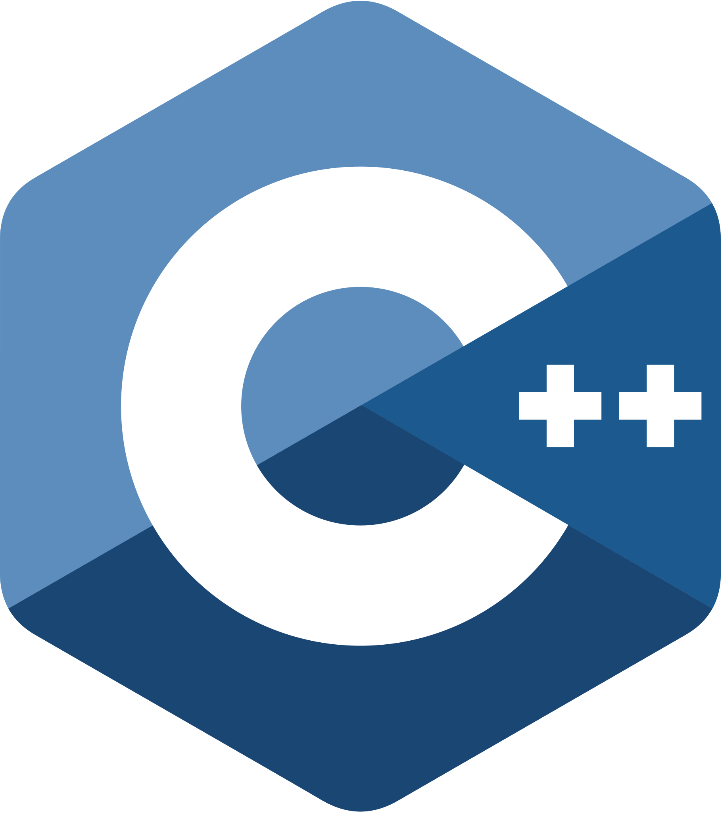
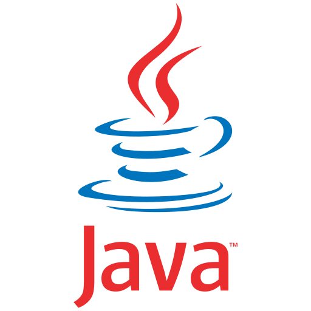
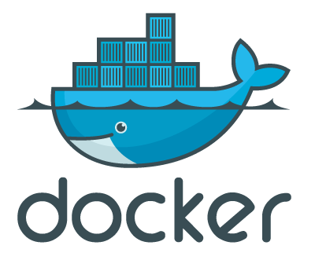

<!--- Olá, esse é meu readme, fique à vontade para utilizá-lo como quiser! -->

-----

<div>

</div>

----- 

Sobre mim:
<h1 align="center">Maisa Rodrigues | Software Engineer & Full-Stack Developer</h1> 
<div align="justify">
Profissional com 4 anos de experiência consolidada no mercado de tecnologia, especializada no desenvolvimento de ecossistemas complexos e integrações de alta criticidade. Minha trajetória é focada na entrega de soluções escaláveis que unem performance técnica e objetivos de negócio.
Apaixonada por inovação, busco constantemente aprimorar minhas habilidades e explorar novas tecnologias para criar produtos que realmente façam a diferença. Com uma abordagem orientada a resultados, estou sempre pronta para enfrentar desafios e contribuir para o sucesso de projetos ambiciosos.
</div>

-----

&nbsp;Expertise Técnica & Engenharia de Sistemas:
<div align="justify">

- 💻 **Arquitetura Full-Stack**<br>
  Desenvolvimento end-to-end utilizando PHP (Laravel) e ReactJS, com foco em código limpo e sistemas de alta disponibilidade.

- 🏢 **Ecossistemas ERP & CRM**<br>
  Experiência na sustentação e evolução de sistemas de gestão empresarial de larga escala, garantindo a integridade de dados e fluidez de processos internos.

- 💳 **Fintech & Gateway de Pagamentos**<br>
  Implementação de checkouts e integrações diretas com Banco Inter, C6 Bank, Sicoob, PayPal e Mercado Pago.

- 📄 **Conformidade Fiscal Nacional**<br>
  Especialista em automação de faturamento, com domínio na emissão de NF-e (Produto) e NFS-e (Serviço), integrando o novo padrão da NFS-e Nacional e APIs governamentais.

- 🔌 **Integração de Hardware (IoT)**<br>
  Desenvolvimento de soluções que conectam software ao mundo físico, como sistemas de pesagem com balanças comerciais e coleta de feedback via botoeiras físicas (NPS).

- 📺 **Digital Signage & Mídia Indoor**<br>
  Gestão técnica e desenvolvimento de soluções para AlphaSignage e sistemas de Video Wall.

- 🌍 **Implantação Global**<br>
  Vivência na entrega de sistemas em escala internacional, lidando com manutenção de sistemas legados e refatoração para escalabilidade.

- ⚡ **Consumo de Dados em Real-Time**<br>
  Desenvolvimento de layouts RSS dinâmicos para processamento de XML em interfaces de tempo real (clima, cotações, loterias).

</div>

-----


<div>

&nbsp;Stack Tecnológica:
<div align="center">

[](https://github.com/tandpfun/skill-icons)


<!-- <code><a href="https://www.python.org/" target="_blank"></a></code>
&nbsp; 
<code><a href="https://www.open-std.org/jtc1/sc22/wg14/" target="_blank"></a></code>
&nbsp; 
<code><a href="https://isocpp.org/" target="_blank"></a></code>
&nbsp;  
<code><a href="https://www.java.com/pt-BR/" target="_blank"></a></code>
&nbsp;  
<code><a href="https://www.w3schools.com/html/" target="_blank"></a></code>
&nbsp; 
<code><a href="https://www.w3schools.com/css/" target="_blank"></a></code>
&nbsp; 
<code><a href="https://www.w3schools.com/js/" target="_blank"></a></code>
&nbsp; 
<code><a href="https://pt-br.reactjs.org/" target="_blank"></a></code>
&nbsp;  
<code><a href="https://www.php.net/" target="_blank"></a></code>
&nbsp; 
<code><a href="https://laravel.com/" target="_blank"></a></code>
&nbsp;  
<code><a href="https://www.mysql.com/" target="_blank"></a></code>
&nbsp;    
<code><a href="https://dbeaver.io/" target="_blank"></a></code>
&nbsp; 
<code><a href="https://nodejs.org/en/" target="_blank"></a></code>
&nbsp;  
<code><a href="https://www.docker.com/" target="_blank"></a></code>
&nbsp; 
<code><a href="https://aws.amazon.com/pt/" target="_blank"></a></code>
&nbsp;  
<code><a href="https://www.postman.com/" target="_blank"></a></code>
&nbsp; 
<code><a href="https://insomnia.rest/" target="_blank"></a></code>
&nbsp;  
<code><a href="https://www.jetbrains.com/pt-br/pycharm/download/" target="_blank"></a></code>
&nbsp; 
<code><a href="https://www.eclipse.org/downloads/" target="_blank"></a></code>
&nbsp;  
<code><a href="https://code.visualstudio.com/" target="_blank"></a></code>
&nbsp; -->
</div>

-----

GitHub Stats:

<div>
    
    <!---  -->
    
    
</div> 
 

<div align="center"> 
<a href="https://www.linkedin.com/in/maisa-rodrigues-674a2a218/" target="_blank"></a>
<a href="mailto:maisagabirodrigues@gmail.com" target="_blank"></a>
<a href="https://wa.me/5531991805907" target="_blank"></a>
<a href="https://github.com/amaple28" target="_blank"></a>
</div>

<p align="center">
</img>
</p>

-----


<!-- <div> 
                                   
```text	
    

 █████╗  ███╗   ███╗  █████╗   █████╗  ██╗      ██████╗
██╔══██╗ ████╗ ████║ ██╔══██╗ ██   ██╗ ██║      ██╔═══╝
███████║ ██╔████╔██║ ███████║ ███████║ ██║      ██████╗
██╔══██║ ██║╚██╔╝██║ ██╔══██║ ██╔════╝ ██╚════╗ ██╔═══╝
██║  ██║ ██║ ╚═╝ ██║ ██║  ██║ ██║      ███████║ ██████╗
╚═╝  ╚═╝ ╚═╝     ╚═╝ ╚═╝  ╚═╝ ╚═╝      ╚══════╝ ╚═════╝
``` 
</div>  -->

  
<!--- Obrigada pela visita! -->
